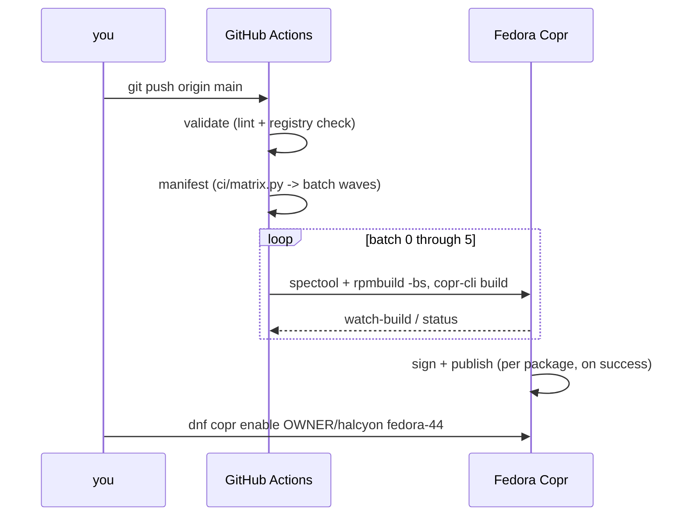

# halcyon-packages — setup guide

Stand up **halcyon-packages** from zero: an empty GitHub account to a signed,
publicly installable Copr repository. If you're already working in an
existing checkout, see `README.md` for day-to-day commands and `AGENTS.md`
for spec conventions — this document is only for the first bring-up.

## Prerequisites

| requirement | why |
|---|---|
| A GitHub account | hosts the repo and runs the workflows |
| A Fedora account | Copr build farm, signing, and hosting |
| `git`, `gh` | pushing, secrets, watching runs |
| `python3 ≥ 3.11` | `ci/matrix.py` / `ci/sweep/sweep.py` (stdlib only) |
| `copr-cli`, `mock` (optional) | local dry-runs before pushing |

Everything under `ci/` and `tools/` is stdlib Python; the heavy lifting
(`rpmbuild`, `mock`, `copr-cli`) lives in the CI job image, not on your host.

## 1. Create the Copr project

```bash
sudo dnf install copr-cli
```

Create a Fedora account at
[accounts.fedoraproject.org](https://accounts.fedoraproject.org/), log in at
[copr.fedorainfracloud.org](https://copr.fedorainfracloud.org/) via **OIDC**,
then copy the API snippet from
[copr.fedorainfracloud.org/api](https://copr.fedorainfracloud.org/api/) into
`~/.config/copr`:

```bash
mkdir -p ~/.config && $EDITOR ~/.config/copr && chmod 600 ~/.config/copr
copr-cli whoami   # must print your login

copr-cli create halcyon --chroot fedora-44-x86_64 --appstream off --enable-net on \
  --description "RPM repository for the halcyon image, built from github.com/OWNER/NAME." \
  --instructions "Enable with: dnf copr enable OWNER/halcyon fedora-44"

copr-cli edit-chroot halcyon/fedora-44-x86_64 --repos \
  "https://repos.fyralabs.com/terra44 \
   https://download.copr.fedorainfracloud.org/results/lionheartp/Hyprland/fedora-44-x86_64/"
```

Terra 44 supplies `anda-srpm-macros` for the rust specs; `lionheartp/Hyprland`
is a lowest-priority bootstrap repo only — once this project's own builds
exist, its `priority=1` repo wins for every package it owns. Copr retention:
the newest **successful** build per package is kept, older ones pruned after
14 days, and only Fedora-allowed licenses build cleanly.

## 2. Push the repository and wire the secret

The `COPR_CLICONF` secret must exist **before the first content push** —
that push fires the full build cascade, which cannot authenticate without it.

```bash
gh repo create halcyon-packages --source . --push   # or: add a remote + git push -u origin main
gh secret set COPR_CLICONF --repo OWNER/NAME < ~/.config/copr
```

Verify the default branch is `main` (every workflow triggers on it):
`gh repo view --json defaultBranchRef`.

## 3. Watch the first cascade

The push builds the CI job image, then runs `copr-build.yml` unattended:
validate → resolve the build plan → six batch waves (4 is intentionally
empty), each waiting on Copr before the next starts.



```bash
gh run watch
copr-cli monitor halcyon
```

A failed build never blocks the next wave's *other* packages, and never
replaces an already-published version — re-push (or dispatch
`copr-build.yml` with `only=<pkg>`) once it's fixed.

## 4. Enable the consumer side

```bash
sudo install -Dm644 repo/halcyon.repo /etc/yum.repos.d/halcyon.repo
sudo dnf install hyprland texlive-meta
```

`repo/halcyon.repo` carries `priority=1`, so dnf prefers this repo's builds
over same-named Fedora/Terra packages. Regenerate it if your Copr owner
differs from `aahsnr-work`.

## 5. Turn on the scheduled automation

Install the [Renovate app](https://github.com/apps/renovate) on the repo
once — `update.yml` (Monday floor) and `texlive-update.yml` (biweekly) then
run on their own, each dispatching `copr-build.yml` on a real change.

## Troubleshooting

| symptom | cause / fix |
|---|---|
| waves never start; `manifest` job red | `ci/matrix.py` validation failed — check for a batch-order or registry error in the job log |
| a wave's builds all fail authenticating | `COPR_CLICONF` missing, wrong, or its token expired (180 days) — regenerate at `/api/`, re-set the secret |
| `rpmbuild -bs` 404s on a `Source*` URL | the upstream artifact moved after a version bump — check release assets against the spec |
| wave *N+1* fails resolving a dependency | wave *N*'s build didn't actually succeed — check `copr-cli monitor halcyon` before assuming a fresh failure |
| texlive roll reports "no snapshot answered" | `texlive.info` is fronted by Anubis; `roll.py` already sends a wget-shaped User-Agent — don't "clean it up" |
| a daily bump turns a build red | the upstream release changed its artifact naming — check assets against the spec's `Source*` pattern |
| `matrix.py: cannot determine the revision` | run it from inside a git clone with history (`--since` needs `git diff`) |

## Recreating from scratch again

Steps 1–2 are the only ones that need real external state (a Copr project +
the secret); everything else — specs, the registry, the workflows — is
already checked into this repo, so a from-zero redo is just: create the
project, set the secret, push, watch.
