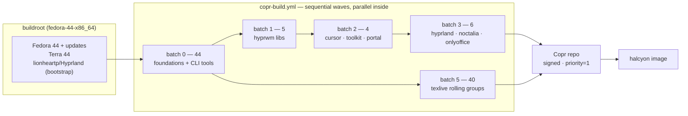
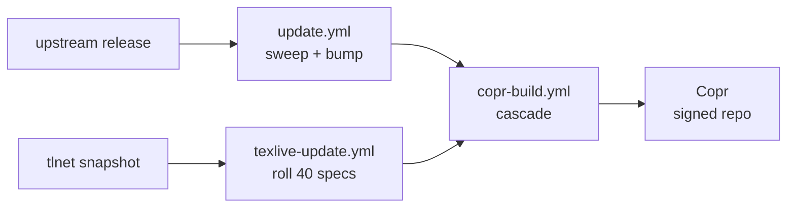

# halcyon-packages

Every non-Fedora package the **halcyon** image needs, built and published on
[Fedora Copr](https://copr.fedorainfracloud.org/coprs/aahsnr-work/halcyon/)
(`aahsnr-work/halcyon`, chroot `fedora-44-x86_64`) with automated upstream
version tracking.

```bash
sudo dnf copr enable aahsnr-work/halcyon fedora-44
# or, to shadow Fedora/Terra with everything built here (priority=1):
sudo install -Dm644 repo/halcyon.repo /etc/yum.repos.d/halcyon.repo
```

Copr owns the build farm, GPG signing, and repo hosting. This repo carries
only specs, the build registry, the version sweeper, and the workflows that
drive Copr.

> **New here?** [Instructions.md](Instructions.md) walks through standing
> this project up from zero. This document is the day-to-day reference.

## Layout

| path | what |
|---|---|
| `pkgs/<pkg>/` | one spec per package, plus anything it references (patches, metainfo, macros) |
| `ci/packages.toml` | the **registry** — batch + sweep feed per package; a package without an entry is never built |
| `ci/matrix.py` | resolves a push into the per-batch build matrix |
| `ci/sweep/` | the upstream version sweeper (`sweep.py`, feed logic in `feeds.py` / `custom.py`) |
| `tools/texlive-splitter/` | the texlive roll: `roll.py` (driver), `splitter.py` (tlpdb parser), `emit_groups.py` (spec renderer) |
| `.github/builder/` | the CI job image (fedora-minimal 44 + copr-cli, python3, rpm-build, rpmdevtools, mock) |
| `.github/workflows/` | `copr-build.yml`, `update.yml`, `texlive-update.yml`, `repoclosure.yml`, `builder-docker.yml` |
| `repo/halcyon.repo` | the consumer drop-in (priority=1 + project GPG key) |
| `templates/` | starting points for new specs |

## How a build works

**Batches are dependency levels, not parallel groups.** Packages inside one
batch build in parallel and must never require each other; batch *N* may
`BuildRequire` batch *< N* output, because Copr publishes each successful
build to the project repo immediately — wave *N+1* installs wave *N*'s
result the moment it lands.



| wave | contents |
|---|---|
| **0** (44) | hyprwm foundations (`hyprutils`, `hyprlang`, `hyprwayland-scanner`, `hyprland-protocols`, `glaze`) · rust CLI tools (`atuin`, `bat`, `dust`, `eza`, `starship`, `tealdeer`, `texlab`, `yazi`, `zellij`, `zoxide`, `fd-find`, `cliphist`) · vendor apps (`bun`, `bitwarden`, `obsidian`, `opencode`, `opencode-desktop`, `pixi`, `uv`, `ticktick`, `zotero`, `marksman`, `lazygit`, `pandoc`, `ferdium`, `antigravity-ide`, `antigravity-cli`) · source builds (`fzf`, `fzy`, `kilo`, `nwg-displays`) · `cava`, `chafa`, `gnuplot`, `kitty`, `distroshelf`, `nwg-look`, `qt6ct`, `pyprland`, `xwiimote-ng` |
| **1** (5) | `aquamarine`, `hyprgraphics`, `hyprlang`, `hyprwire`, `noctalia-greeter-git` |
| **2** (4) | `hyprcursor`, `hyprland-qt-support`, `hyprtoolkit`, `xdg-desktop-portal-hyprland` |
| **3** (6) | `hyprland`, `hyprland-guiutils`, `hyprpwcenter`, `hyprshutdown`, `noctalia`, `onlyoffice-desktopeditors` |
| **4** | *intentionally empty* |
| **5** (40) | the `texlive-*` rolling groups + `texlive-meta` — Fedora-only inputs, isolated last |

`onlyoffice-desktopeditors` sits in batch 3 by maintainer choice, not
dependency; `texlive-meta` installs the whole scheme.

## Automation

| workflow | trigger | does |
|---|---|---|
| `copr-build.yml` | push to `pkgs/**`/`ci/**`, PRs, manual | validate → `matrix.py` selects changed packages + BuildRequires dependents → submits SRPMs wave-by-wave, waits per wave |
| `update.yml` | after every cascade + Monday 04:17 UTC floor, manual | `ci/sweep/sweep.py` bumps specs from upstream feeds, commits to `main`, dispatches the next cascade |
| `texlive-update.yml` | biweekly Wednesdays (even ISO weeks), manual | `roll.py` regenerates the 40 texlive group specs from the newest tlnet snapshot |
| `repoclosure.yml` | after every cascade + daily | `dnf repoclosure` over the published repo |
| `builder-docker.yml` | push to `.github/builder/**` | rebuilds the CI job image; cascades wait for the same-commit run |



The loop is self-driving and self-healing: a failed build never replaces
the published one (Copr keeps the newest *successful* build per package),
and the sweep only writes specs whose content actually changed.

## Adding a package

1. Write `pkgs/<pkg>/<pkg>.spec` from `templates/source-build.spec.tmpl` or
   `templates/binary-wrapper.spec.tmpl`. Rules that bite:
   - full URLs in `Source*` — the submit job fetches them with `spectool -g`
     before `rpmbuild -bs`; keep downloads out of `%prep`;
   - explicit `Release: N%{?dist}` + a written `%changelog` — no rpmautospec;
   - `%define debug_package %{nil}` always; prebuilt-ELF rewraps also add
     `%global _build_id_links none` (see `obsidian`, `onlyoffice-desktopeditors`);
   - build-time repos outside Fedora/Terra go in the **Copr chroot's repo
     list** (`copr-cli edit-chroot`), never in the spec.
2. Register it in `ci/packages.toml`: a `batch` ≥ 1 + the highest batch of
   anything it `BuildRequires`, and an `[pkg.updates]` feed
   (`github-release` / `github-tag`, or `custom` + a function in
   `ci/sweep/custom.py`).
3. Verify locally (see **Operating** below), then push.

## Operating

```bash
# one package, end to end
spectool -g -C _srpms/<pkg> pkgs/<pkg>/<pkg>.spec
rpmbuild -bs --define "_sourcedir $PWD/_srpms/<pkg>" \
         --define "_srcrpmdir $PWD/_srpms" \
         --define "_specdir $PWD/pkgs/<pkg>" pkgs/<pkg>/<pkg>.spec
copr-cli build --nowait halcyon _srpms/<pkg>-*.src.rpm
copr-cli watch-build <id>; copr-cli status <id>

# the full picture
copr-cli monitor halcyon                  # per-package states
python3 ci/matrix.py --list                # the whole build plan
python3 ci/matrix.py --list --since <sha>  # what a push would rebuild
python3 ci/sweep/sweep.py --pkg <pkg>      # one feed, dry

# a mock buildroot identical to Copr's, for local debugging
copr-cli mock-config aahsnr-work/halcyon fedora-44-x86_64 > /tmp/copr.cfg
mock -r /tmp/copr.cfg _srpms/<pkg>-*.src.rpm
```

`COPR_CLICONF` (repo secret) drives every `copr-cli` step in CI; the API
token **expires after 180 days** — a wave of 401/403s means regenerate one
at [copr.fedorainfracloud.org/api](https://copr.fedorainfracloud.org/api/).

## Sharp edges

- **Copr's brp hooks run stricter than typical mock defaults**: the shebang
  mangler, `check-rpaths`, and build-id link writing hard-fail vendor
  rewraps — the affected specs carry targeted `%{nil}` defines; don't strip
  them.
- **gcc 16 vs hyprwm generated code**: empty vtable arrays in
  wayland-scanner output are hard errors under `-Wpedantic`; affected specs
  strip the flag until upstream is gcc-16 clean.
- **texlive**: scheme-full without documentation, rolled biweekly from tlnet
  snapshots; a bad roll self-heals (Copr keeps the last good build) —
  reverting the roll commit reverts the repo.
- **onlyoffice**: a 363 MB vendor payload, ~1 h build — the one package
  with a real timeout story (the project's 5 h default is ample).

See `AGENTS.md` for the full set of spec conventions.
