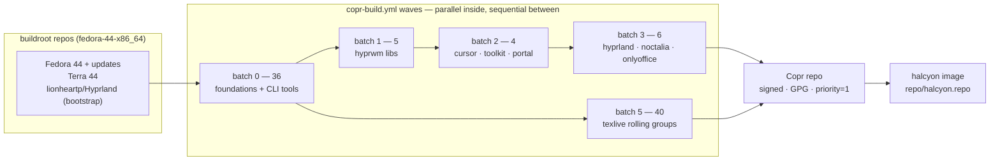

# halcyon-packages

Every non-Fedora package the halcyon image consumes, built on **Fedora Copr**
([aahsnr-work/halcyon](https://copr.fedorainfracloud.org/coprs/aahsnr-work/halcyon/))
with automated upstream version tracking.

```bash
sudo dnf copr enable aahsnr-work/halcyon fedora-44
# or, to shadow Fedora/Terra with everything built here:
sudo cp repo/halcyon.repo /etc/yum.repos.d/     # priority=1 + project GPG key
```

Copr owns the build farm, the GPG signing and the repo hosting. This repo
carries only specs, the registry (`ci/packages.toml` — the build selection
AND the sweep-feed config; a package without an entry is never built), the
sweeper and the workflows.

## Layout

| path | what |
|------|------|
| `pkgs/<pkg>/` | one spec per package plus what it references (patches, metainfo, macros) |
| `ci/` | `packages.toml` (registry), `matrix.py` (build-matrix generator), `sweep/` (version sweeper) |
| `tools/texlive-splitter/` | the texlive roll: `roll.py` (driver), `splitter.py` (tlpdb parser + group partition), `emit_groups.py` (spec renderer) |
| `.github/builder/` | the CI job image (fedora-minimal 44 + copr-cli, python3, rpm-build, rpmdevtools, mock) |
| `.github/workflows/` | `copr-build.yml`, `update.yml`, `texlive-update.yml`, `repoclosure.yml`, `builder-docker.yml` |
| `repo/halcyon.repo` | the consumer drop-in (priority=1 + project GPG key) |
| `templates/` | starting points for new specs |

## Package batches

Batches are dependency levels: batch N may BuildRequire batch < N output
(Copr makes each green build visible to the project repo immediately, so
wave N+1 installs wave N's result). Packages inside one batch build in
parallel and must never require each other. **Batch 4 is intentionally
empty.**



| wave | contents | builds against |
|------|----------|----------------|
| **0** (36) | hyprwm foundations (`hyprutils`, `hyprlang`, `hyprwayland-scanner`, `hyprland-protocols`, `glaze`) · rust tools (`atuin`, `bat`, `dust`, `eza`, `starship`, `tealdeer`, `texlab`, `yazi`, `zellij`, `zoxide`, `fd-find`, `cliphist`) · vendor apps (`bun`, `bitwarden`, `obsidian`, `opencode`, `pixi`, `uv`, `ticktick`, `zotero`, `marksman`, `lazygit`, `pandoc`) · `cava`, `chafa`, `gnuplot`, `kitty`, `distroshelf`, `nwg-look`, `qt6ct`, `pyprland`, `xwiimote-ng` | Fedora + chroot repos only |
| **1** (5) | `aquamarine`, `hyprgraphics`, `hyprlang`, `hyprwire`, `noctalia-greeter-git` | batch 0 |
| **2** (4) | `hyprcursor`, `hyprland-qt-support`, `hyprtoolkit`, `xdg-desktop-portal-hyprland` | batches 0–1 |
| **3** (6) | `hyprland`, `hyprland-guiutils`, `hyprpwcenter`, `hyprshutdown`, `noctalia`, `onlyoffice-desktopeditors` | batches 0–2 |
| **4** | *empty by design* | — |
| **5** (40) | the `texlive-*` rolling groups + `texlive-meta` (scheme-full, no docs; rolled biweekly, never swept) | Fedora only — placed last for wave isolation |

(`onlyoffice-desktopeditors` sits in batch 3 by maintainer choice, not
dependency; `texlive-meta` installs the whole scheme.)

## Automation

| workflow | trigger | does |
|----------|---------|------|
| `copr-build.yml` | push (`pkgs/**`, `ci/**`, builder/**), PRs, manual (`only`) | validate → `matrix.py` selects changed packages + their BuildRequires dependents → submit SRPMs wave-by-wave, wait per wave |
| `update.yml` | chained after every cascade + weekly floor (Mon 04:17 UTC), manual | the sweeper bumps specs from upstream feeds, commits to `main` and dispatches the next cascade (or opens one bump PR in `UPDATE_MODE=pr`) |
| `texlive-update.yml` | biweekly Wednesdays (even ISO weeks), manual | `roll.py` regenerates the 40 group specs from the newest tlnet snapshot and dispatches the cascade |
| `repoclosure.yml` | after every cascade + daily | `dnf repoclosure` over the published repo — a package whose deps nothing satisfies fails the check |
| `builder-docker.yml` | push (`.github/builder/**`) | rebuilds the CI job image; cascades wait for the same-commit image run |

The loop is self-driving and self-healing: upstream release → sweep bump →
cascade → published RPM. A failed build never replaces the published one
(Copr serves the newest *successful* build per package), and the sweep only
writes specs whose content actually changed. Sources fetch at SRPM-build
time (`spectool -g`) — full URLs in `Source*`; the texlive groups are the
exception (no URL sources, they wget member tarballs from the dated
snapshot during `%build`).

## Adding a package

1. `pkgs/<pkg>/<pkg>.spec` — start from `templates/source-build.spec.tmpl`
   or `binary-wrapper.spec.tmpl`. Rules that bite:
   - full URLs in `Source*` (the submit job fetches them before
     `rpmbuild -bs`); keep downloads out of `%prep`;
   - explicit `Release: N%{?dist}` + a written `%changelog` — no
     rpmautospec;
   - `%define debug_package %{nil}` — no debug* packages, ever;
   - prebuilt-ELF rewraps also carry `%global _build_id_links none` (see
     `obsidian` / `onlyoffice-desktopeditors`);
   - build-time repos outside Fedora/Terra go in the **chroot repo list**
     (`copr-cli edit-chroot …`), not the spec.
2. Register in `ci/packages.toml`: a `batch` ≥ 1 + the highest batch of
   anything it BuildRequires, and an `[pkg.updates]` feed
   (`github-release` / `github-tag` with `repo =`, or `custom` + a function
   in `ci/sweep/custom.py`).
3. Push — the workflow builds it. Verify locally first with the mock
   one-liner below.

## Operating

```bash
# create the project (from zero)
copr-cli create halcyon --chroot fedora-44-x86_64 --appstream off --enable-net on \
  --description "RPM repository for the halcyon image, built from github.com/aahsnr-work/halcyon-packages." \
  --instructions "Enable with: dnf copr enable aahsnr-work/halcyon fedora-44"
copr-cli edit-chroot halcyon/fedora-44-x86_64 --repos \
  "https://repos.fyralabs.com/terra44 \
   https://download.copr.fedorainfracloud.org/results/lionheartp/Hyprland/fedora-44-x86_64/"

# one package, end to end
spectool -g -C _srpms/<pkg> pkgs/<pkg>/<pkg>.spec
rpmbuild -bs --define "_sourcedir $PWD/_srpms/<pkg>" \
         --define "_srcrpmdir $PWD/_srpms" \
         --define "_specdir $PWD/pkgs/<pkg>" pkgs/<pkg>/<pkg>.spec
copr-cli build --nowait halcyon _srpms/<pkg>-*.src.rpm
copr-cli watch-build <id>; copr-cli status <id>

# the full picture
copr-cli monitor halcyon                 # per-package states
python3 ci/matrix.py --list --since <sha> # what a push would rebuild
python3 ci/sweep/sweep.py --pkg <pkg>     # one feed, dry

# a mock buildroot identical to Copr's, for local debugging
copr-cli mock-config aahsnr-work/halcyon fedora-44-x86_64 > /tmp/copr.cfg
mock -r /tmp/copr.cfg _srpms/<pkg>-*.src.rpm
```

`COPR_CLICONF` (repo secret) drives every copr-cli step in CI; the API
token expires after **180 days** — 401/403 waves mean regenerate at
[copr.fedorainfracloud.org/api](https://copr.fedorainfracloud.org/api/).

## Recreating from zero

Strict order — the `COPR_CLICONF` secret must exist **before** the first
content push (the push fires the full cascade, which cannot authenticate
without it). Prerequisites: a Fedora box/container with `dnf`, `git`, `gh`.

1. **Copr account + token**: create a Fedora account at
   [accounts.fedoraproject.org](https://accounts.fedoraproject.org/), log
   in at [copr.fedorainfracloud.org](https://copr.fedorainfracloud.org/)
   via **OIDC**, then:

   ```bash
   sudo dnf install copr-cli
   # copy the snippet from copr.fedorainfracloud.org/api/ into:
   mkdir -p ~/.config && $EDITOR ~/.config/copr && chmod 600 ~/.config/copr
   copr-cli whoami        # must print your login
   ```

2. **Secret + project**:

   ```bash
   gh auth login
   gh secret set COPR_CLICONF --repo OWNER/NAME < ~/.config/copr
   copr-cli create halcyon --chroot fedora-44-x86_64 --appstream off --enable-net on \
     --description "RPM repository for the halcyon image, built from github.com/OWNER/NAME." \
     --instructions "Enable with: dnf copr enable OWNER/halcyon fedora-44"
   copr-cli edit-chroot halcyon/fedora-44-x86_64 --repos \
     "https://repos.fyralabs.com/terra44 \
      https://download.copr.fedorainfracloud.org/results/lionheartp/Hyprland/fedora-44-x86_64/"
   ```

3. **Push + watch** — `git push -u origin main` runs, unattended: the CI
   image build, the validate job, then waves 0→3 (4 empty) and 5 (the 40
   texlive groups); ~51 packages are created server-side by their first
   build.

   ```bash
   gh run watch; copr-cli monitor halcyon
   ```

4. **Consumers + automation**: install `repo/halcyon.repo` (priority=1),
   `dnf install hyprland texlive-meta`; install the
   [Renovate app](https://github.com/apps/renovate) once — the scheduled
   workflows then run on their own.

Token renewal: the 180-day expiry shows up as 401/403 waves in
copr-build.yml — regenerate at `/api/` and re-run step 2's secret command.
Copr constraints: builds pruned after 14 days (newest successful per
package kept), Fedora-allowed licenses only.

## Sharp edges

- **Copr's brp hooks run stricter than mock defaults**: the shebang
  mangler (texlive's 185k scripts — but the groups also normalize
  pre-usrmerge `#!/bin/` shebangs), `check-rpaths` and build-id link
  writing hard-fail vendor rewraps — the affected specs carry targeted
  `%global … %{nil}` defines; don't strip them.
- **gcc 16 vs hyprwm generated code**: the empty vtable arrays in
  wayland-scanner output are hard errors under gcc 16 with `-Wpedantic`;
  affected specs strip the flag until upstream is gcc-16 clean.
- **texlive**: scheme-full without documentation, rolled biweekly from
  tlnet snapshots; a bad roll self-heals (Copr keeps the last good build)
  and reverting the roll commit reverts the repo.
- **onlyoffice**: 363 MB vendor payload, ~1 h build — the one package with
  a real timeout story (project default 5 h is ample).
